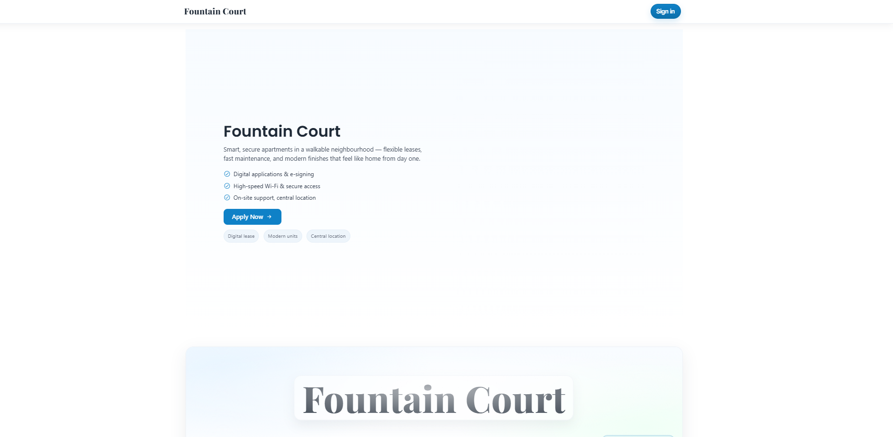
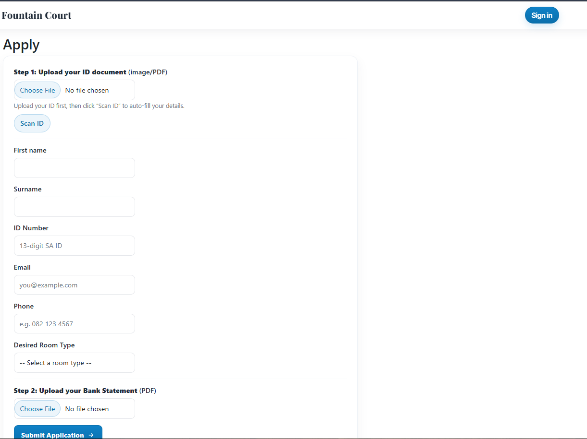
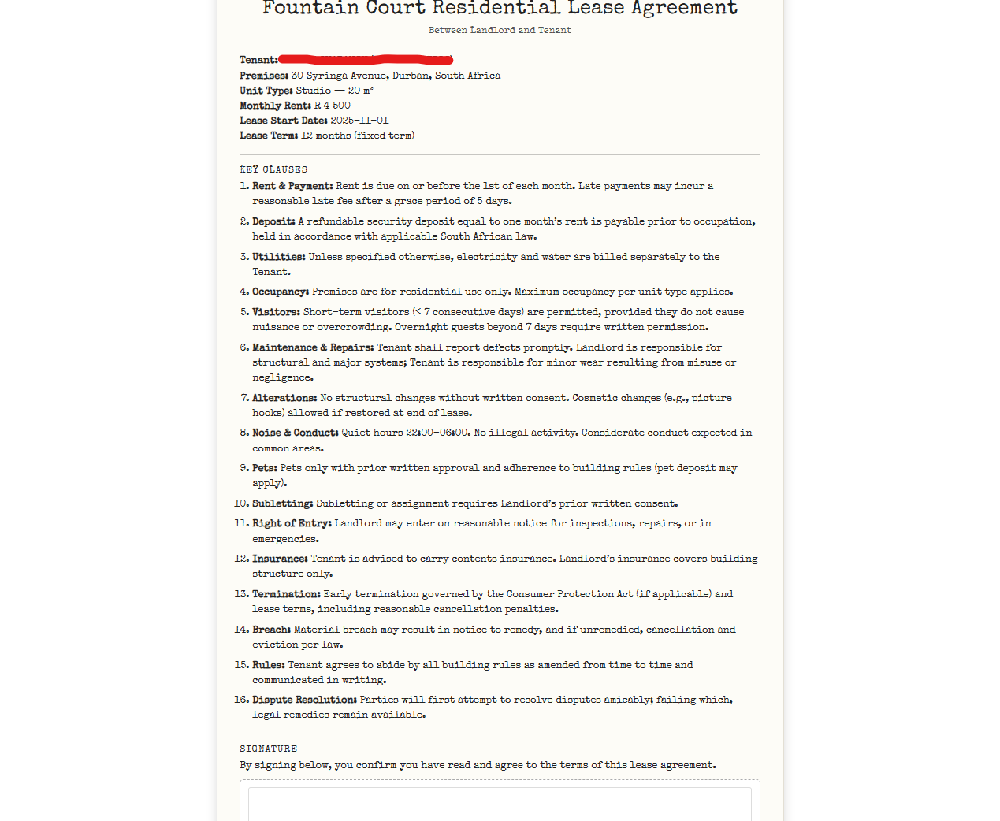
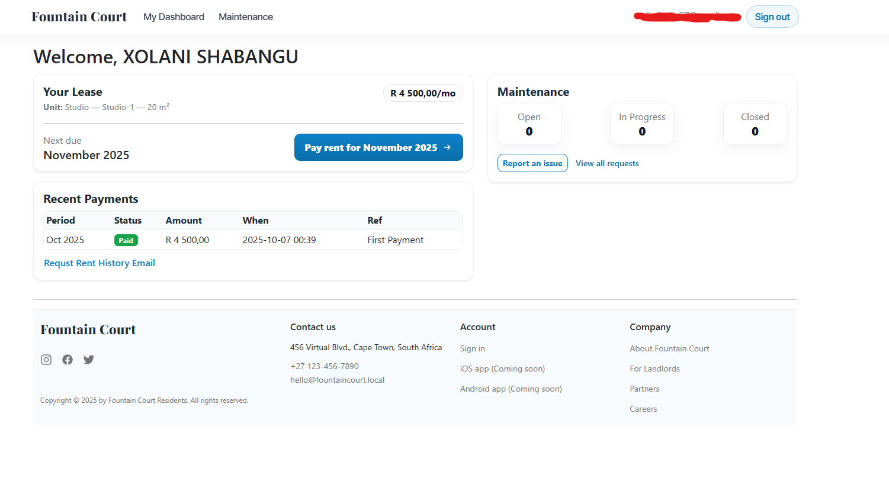
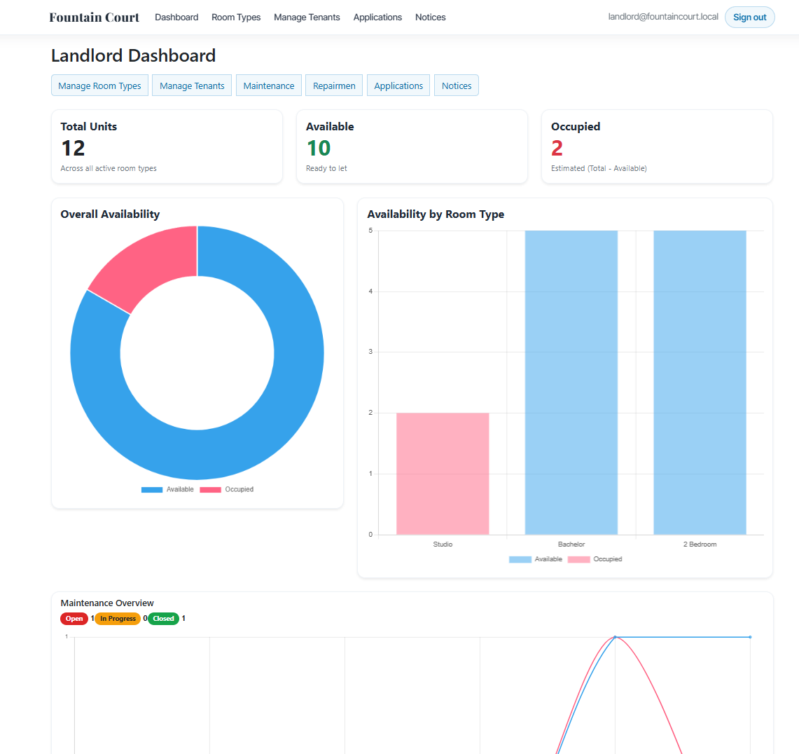
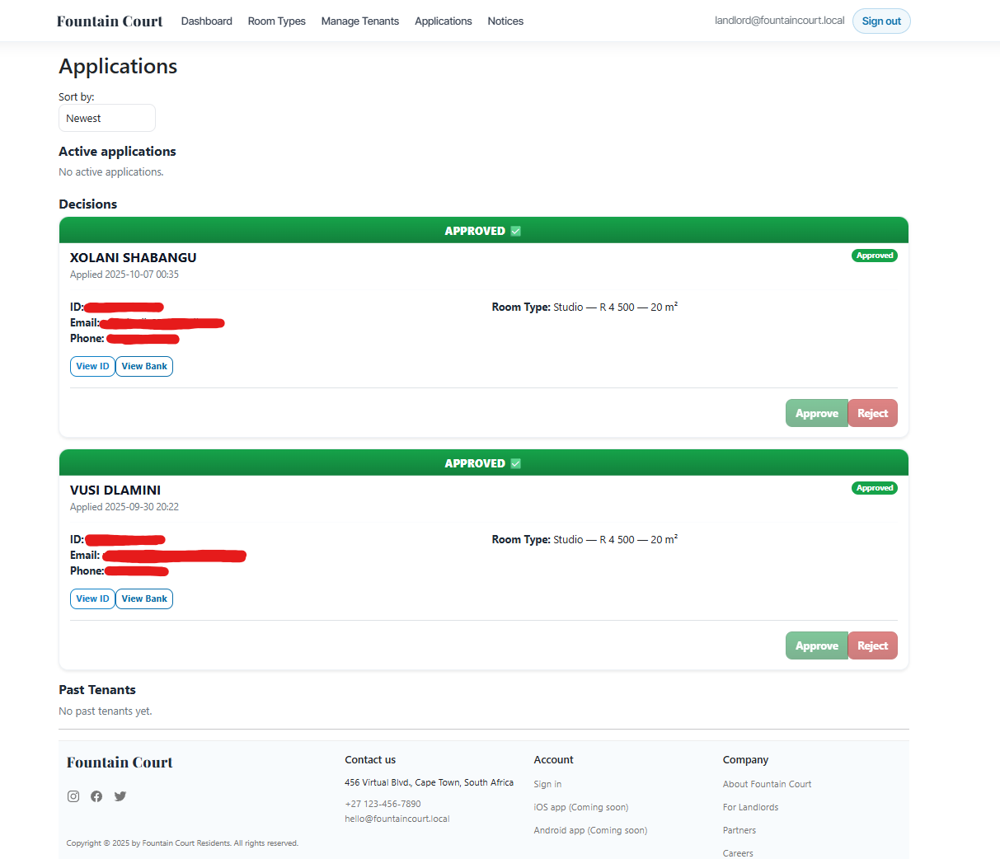
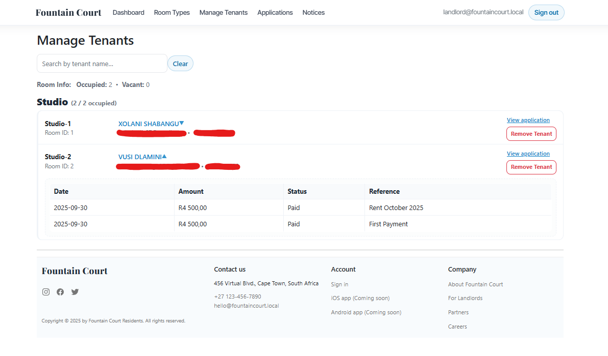
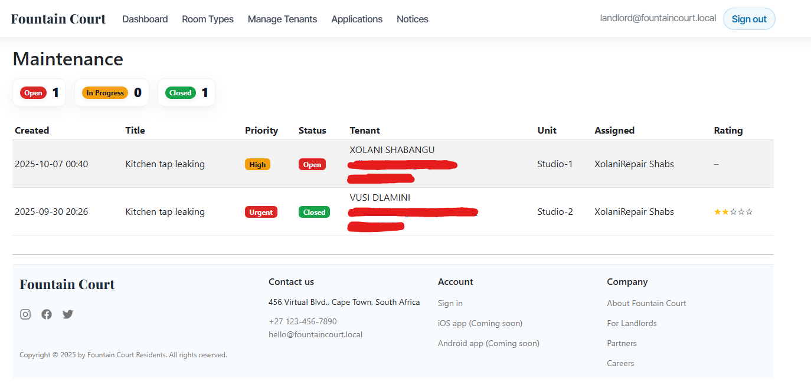

# 🏢 Fountain Court Residents – Rental & Tenant Management System

## About
The **Fountain Court Residents System** is a web-based platform that simplifies rental management for **landlords**, **tenants**, and **repairmen**.  
It handles everything from **tenant applications and digital lease signing** to **rent payments, maintenance tracking**, and **landlord analytics** — creating a seamless property management experience.

---

## 📌 Features

### 🏠 Online Application & Lease Signing
- Tenants apply online and upload ID + bank statement.  
- The system uses **Azure OCR** to auto-fill personal info from the ID.  
- Once approved, tenants receive a **digital lease** to e-sign and make their first payment.

### 🧾 Payments & Receipts
- Tenants securely pay deposits or rent through **Stripe**.  
- Receipts are automatically emailed upon successful payment.

### 🧰 Maintenance & Repair Requests
- Tenants can log issues with photos and descriptions.  
- The system assigns the ticket to a **repairman**, who updates progress until resolved.

### 📊 Landlord Dashboard & Controls
- Landlords view occupancy, revenue, tenant lists, and repair performance.  
- They can manage tenant records, approve or reject new applications, and post notices.

### 🔑 Role-Based Access
| Role | Description |
|------|--------------|
| **Landlord** | Manages applications, tenants, maintenance, and payments. |
| **Tenant** | Applies, signs leases, pays rent, and tracks maintenance. |
| **Repairman** | Sees assigned repair tasks and updates job progress. |

---

## 🛠️ Tech Stack
- **Frontend:** HTML, CSS, Bootstrap  
- **Backend:** ASP.NET MVC 5 (C#)  
- **Database:** SQL Server (Entity Framework DB-First)  
- **Cloud Services:** Azure Computer Vision (OCR)  
- **Payments:** Stripe (Test Mode)  
- **Email:** MailKit SMTP  

---

## 👥 Demo Login
| Role | Email | Password |
|------|-------|-----------|
| Landlord | `landlord@fountaincourt.local` | `Landlord@12345` |
| Tenant | Created after lease payment | – |
| Repairman | Created by Landlord | – |

---

## 📸 Screenshots of Views

### 🏠 Landing Page
Shows available room types and pricing for potential tenants.  

---

### 📝 Application Page
Tenant applies online, uploads ID and bank statement, and submits for approval.  

---

### 🖋️ Lease Signing Page
After approval, tenant signs the digital lease before proceeding to payment.  

---

### 👤 Tenant Dashboard
Shows tenant details, notices, payments, and quick access to maintenance requests.  

---

### 🧰 Tenant Maintenance View
Tenants create and track maintenance requests, view job status and updates.  

---

### 📊 Landlord Dashboard
Displays stats on occupancy, maintenance trends, and payment summaries.  

---

### 📄 Landlord Applications View
Lists all tenant applications with status, ID previews, and approval/rejection options.  

---

### 👥 Manage Tenants View
Landlord can view all current tenants, see payment history, and remove inactive ones.  

---

### 🔧 Landlord Maintenance View
Displays all open repair requests, assigned repairmen, and completion statuses.  

---

## ⚙️ Setup
1. Clone the repository and open in **Visual Studio 2022**.  
2. Restore NuGet packages automatically.  
3. Update the connection string in `Web.config` to your SQL instance.  
4. Run the project (`Ctrl + F5`) and sign in as Landlord.  

---

## 📄 License
MIT License – Educational use only.
